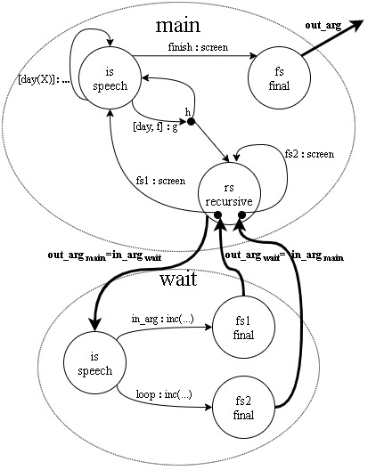

# SitLog
SitLog is a declarative situation-oriented logical language for programming situated service robots’ tasks. The formalism is task and domain independent and can be used in a wide variety of settings. SitLog can also be seen as a behavior engineering specification and interpretation formalism to support action selection by autonomous agents during the execution of complex tasks. For more details see the paper [SitLog: A Programming Language for Service Robot Tasks](https://doi.org/10.5772/56906).

SitLog is used by the robot [Golem III](http://golem.iimas.unam.mx/home.php?lang=en&sec=home) to perfomed several behaviors and various complex tasks. Therefore, two possible modes of execution of SitLog are available, *test* and *actual*. Since the actual mode is meant to be run on a real agent or robot, in this README we discuss how to set up the test mode. The configuration of SitLog in a real robot varies slightly.

SitLog interpreter is written in Prolog and SitLog’s programs follow closely the Prolog notation, permitting the declarative specification and direct interpretation of complex applications in a modular and compact form. SitLog runs on SWI Prolog (swipl) version 6.6.6. To install such a version in a computer with Ubuntu Operating System perform the following steps.

   1. Download the compressed file found [here](https://www.swi-prolog.org/download/stable/src/pl-6.6.6.tar.gz). 
   2. Open a terminal and run the next command to install the needed libraries:

    sudo apt-get install \
      build-essential cmake ninja-build pkg-config \
      ncurses-dev libreadline-dev libedit-dev \
      libunwind-dev \
      libgmp-dev \
      libssl-dev \
      unixodbc-dev \
      zlib1g-dev libarchive-dev \
      libossp-uuid-dev \
      libxext-dev libice-dev libjpeg-dev libxinerama-dev libxft-dev \
      libxpm-dev libxt-dev \
      libdb-dev \
      libpcre3-dev \
      libyaml-dev \
      default-jdk junit


   3. Open another terminal and change the directory to where the downloaded file in step 1 is located. Then run the commands:

    $ tar zxvf pl-6.6.6.tar.gz
    $ cd pl-6.6.6/src
    $ ./configure
    $ make
    $ sudo make install
        

At this point, a basic version of swipl has been installed, however, some extra packages are missing so we run the next commands to install them.

    $ cd ../packages
    Note: Despite a Java compilation error while executing the next
          step, we can proceed with the rest of the instructions
          to successfully install swipl.
    $ ./configure
    $ make
    $ sudo make install


The final setting that must be perfomed to have SitLog running is to add an environment variable indicating the path of this repository on your computer. Append the following to the file ~/.bashrc

    export SITLOG_HOME=/path_in_your_computer/source_code/


You are ready to run SitLog programs in test mode!

## Sample dialogue model

Now, we describe the execution of the sample code 
found in [sample_main.dm](https://github.com/SitLog/source_code/blob/master/apps/test_behaviors/sample/sample_main.dm), whose diagrammatic representation is given below.



Open a terminal, change the directory to the one with this repository and run:

    $ ./scripts/test_behaviors test


Since the execution mode is test, you will be prompted to enter the dialogue model to be run by Sitlog. So, type

    |: res(sample).


Type ```ok.``` as confirmation. The ```sample_main.dm``` file is loaded.

Initially the value of ```in_arg``` is undefined, moreover, the variable ```count_init``` is assigned to 1 and the first situation is considered, it asks us to enter the expectation that is met. So, we type

    [day(tuesday)].

This matches the second arc, so the local variable ```day``` is set to ```tuesday```, the initial situation is considered again and the value of ```in_arg``` is set to ```monday```. Next, the variable ```count_init``` is assigned to 2 and the expectation that is met has to be manually typed as follows:

    [tuesday,'not ok'].


The third arc is matched, so the last transition is retrieved from the execution history and the control is given to the situation ```rs```, since the values of ```in_arg``` and ```day``` are different. Also, the value of ```in_arg``` is updated to ```tuesday```. Next, the variable ```count_rec``` is assigned to 1 and the execution flow is passed to the embedded dialogue model [sample_wait.dm](https://github.com/SitLog/source_code/blob/master/apps/test_behaviors/sample/sample_wait.dm). Its initial situation is considered, and the expectation that is met waits to be typed.

    loop.


This corresponds to the second arc, so the variable ```g_count_fs2``` is assigned to 1, the final situation ```fs2``` is reached and the execution flow is back to the embedding situation ```rs```. Thus, its second arc is matched, the text ```'Cont. recursive sit'``` is printed on the screen and the situation ```rs``` is considered again. The variable ```count_rec``` is assigned to 2 and the execution flow is passed to the embedded dialogue model *sample_wait.dm*. The expectation of its initial situacion has to be typed as follows.

    tuesday.


Since the value of ```in_arg``` was piped  from one dialogue model the other, the first arc is matched. So, the variable ```g_count_fs1``` is assigned to 1, the final situation ```fs1``` is reached and the execution flow is back to the embedding situation ```rs```. Here, the expectation of the first arc is satisfied, the text ```'Back to initial sit'``` is printed on the screen and the control is passed to the situation ```is```. The variable ```count_init``` is assigned to 3 and the expectation that is met has to be typed as follows:

    [day(monday)].


The second arc is matched, this implies that the local variable ```day``` is set to ```monday```, the initial situation is considered again and the value of ```in_arg``` is now ```monday```. The variable ```count_init``` is assigned to 4 and the user is prompted for next the expectation that is met.

    [monday,ok].


The third arc is matched, next the last transition is retrieved from the execution history and the inistial situation is run again, since the values of ```in_arg``` and ```day``` are the same. Also the value of ```in_arg``` is updated to ```tuesday```. Next, the variable ```count_init``` is assigned to 5 and the expectation that is met has to be typed.

    finish.


The first arc is matched, so the text ```Good bye``` is printed on screen and the control is passed to the final situation ```fs```, ending execution of the sample dialogue model.